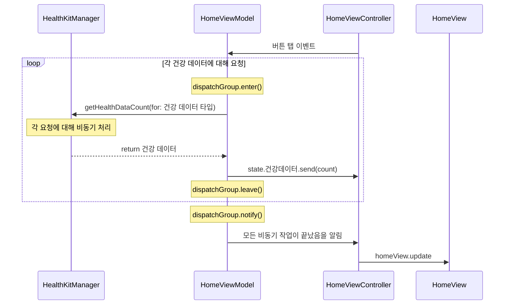

### 개요

여러 개의 비동기 요청을 통해 건강 데이터를 가져온 후, 모든 데이터가 준비되었을 때 버튼의 배경 색상을 변경하는 기능을 구현한다.

### 비동기 작업 관리 구현 아이디어

DispatchGroup을 사용하여 비동기 작업의 완료 여부를 추적하고, 모든 작업이 끝난 후 배경 색을 변경하는 작업을 수행한다.

### 예시 코드

```swift
let dispatchGroup = DispatchGroup()

// 걸음수 데이터 요청
dispatchGroup.enter()
healthManager.getHealthData(for: .stepCount) { stepCount in
    // 데이터 처리 로직
    dispatchGroup.leave()
}
// 이동거리 데이터 요청
// 수면 시간 데이터 요청
// 심박수 데이터 요청

// 모든 비동기 작업이 완료된 후
dispatchGroup.notify(queue: .main) {
    // 작업이 끝났음을 알림
}

```

### 플로우



### 결과

|||
|-|-|
